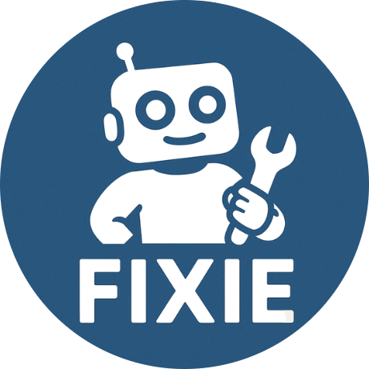
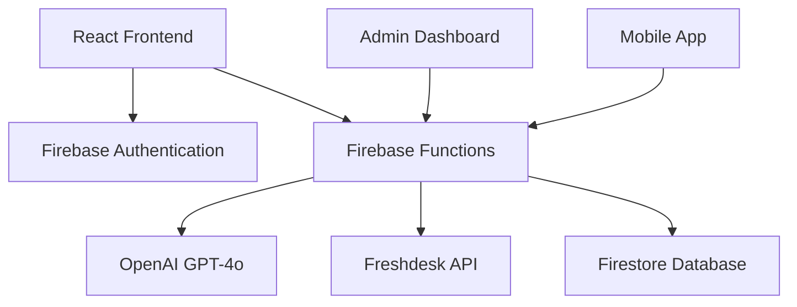

# 🚀 Fixie - AI-Powered IT Support Platform

<div align="center">
  
  
  **Enterprise-Grade AI IT Support That Outperforms Traditional ITSM**
  
  [](https://www.typescriptlang.org/)
  [](https://reactjs.org/)
  [](https://firebase.google.com/)
  [](https://openai.com/)
</div>

---

## 📋 Table of Contents

- [Overview](#overview)
- [🎯 Key Features](#key-features)
- [🏗️ Architecture](#architecture)
- [🚀 Quick Start](#quick-start)
- [🔧 Configuration](#configuration)
- [🔌 Integrations](#integrations)
- [📱 User Interface](#user-interface)
- [🤖 AI Capabilities](#ai-capabilities)
- [🎫 Ticket Management](#ticket-management)
- [🔐 Security](#security)
- [📊 Analytics & Monitoring](#analytics--monitoring)
- [🛠️ Development](#development)
- [📚 API Reference](#api-reference)
- [🤝 Contributing](#contributing)
- [📄 License](#license)

---

## Overview

**Fixie** is a modern, AI-powered IT support platform designed specifically for small-to-medium businesses (SMBs) that need enterprise-grade functionality without the complexity and cost of traditional ITSM solutions like ServiceNow. Built with React, TypeScript, and Firebase, Fixie delivers intelligent IT support through conversational AI, automated troubleshooting, and seamless integrations.

### Why Fixie?

- 🎯 **SMB-Focused**: Designed for companies under 1,000 employees
- ⚡ **Quick Setup**: Deploy in hours, not months
- 💰 **Cost-Effective**: Fraction of the cost of enterprise solutions
- 🤖 **AI-First**: Powered by GPT-4o for intelligent support
- 🔗 **Integration-Ready**: Works with existing tools and workflows

---

## 🎯 Key Features

### 💬 **Intelligent Chat Interface**
- **Real-time Conversations**: Instant messaging with AI-powered responses
- **Context Awareness**: Maintains conversation history and context
- **Multi-language Support**: Handles technical queries in multiple languages
- **Interactive Elements**: Smart buttons for ticket creation and escalation
- **Mobile Responsive**: Optimized for desktop, tablet, and mobile devices

### 🤖 **Advanced AI Capabilities**
- **GPT-4o Integration**: Latest OpenAI model for superior understanding
- **IT-Specialized Training**: Focused on hardware, software, and network issues
- **Automated Troubleshooting**: Step-by-step guidance for common problems
- **Smart Escalation**: Automatically detects when human intervention is needed
- **Learning System**: Improves responses based on interaction patterns

### 🎫 **Enterprise Ticket Management**
- **Automated Ticket Creation**: AI decides when to create support tickets
- **Priority Intelligence**: Smart priority assignment based on issue severity
- **Category Classification**: Automatic categorization of IT issues
- **Audit Trail**: Complete logging of all actions and decisions
- **SLA Tracking**: Monitor response times and resolution metrics

### 🔌 **Seamless Integrations**
- **Freshdesk**: Complete ticket management integration
- **Custom APIs**: Extensible architecture for additional integrations
- **Webhook Support**: Real-time notifications and updates
- **Future-Ready**: Architecture designed for easy integration expansion

### 🔐 **Enterprise Security**
- **Firebase Authentication**: Secure user management
- **Role-Based Access**: Granular permission controls
- **Data Encryption**: End-to-end encryption for sensitive data
- **Audit Logging**: Comprehensive activity tracking
- **Compliance Ready**: SOC 2, GDPR, and HIPAA considerations

---

## 🏗️ Architecture



### Technology Stack

**Frontend:**
- React 18 with TypeScript
- Material-UI components
- CSS Grid & Flexbox
- Progressive Web App (PWA) ready

**Backend:**
- Firebase Functions (Node.js 18)
- Firebase Firestore (NoSQL database)
- Firebase Authentication
- OpenAI API integration

**AI & ML:**
- GPT-4o for natural language processing
- Custom prompt engineering for IT support
- Tool calling for automated actions
- Context-aware conversation management

**Integrations:**
- Freshdesk API
- Custom webhook support
- Extensible architecture for future integrations

---

## 🚀 Quick Start

### Prerequisites

- **Node.js** 18.x or higher
- **npm** or **yarn** package manager
- **Firebase CLI** installed globally
- **Firebase project** with Firestore and Functions enabled

### Installation

1. **Clone the repository:**
   ```bash
   git clone https://github.com/your-org/fixie-platform.git
   cd fixie-platform
   ```

2. **Install dependencies:**
   ```bash
   npm install
   cd functions && npm install && cd ..
   ```

3. **Configure Firebase:**
   ```bash
   firebase login
   firebase use your-project-id
   ```

4. **Set up environment variables:**
   ```bash
   # Set OpenAI API key
   firebase functions:secrets:set OPENAI_API_KEY
   
   # Set Freshdesk credentials (required for ticket creation)
   firebase functions:secrets:set FRESHWORKS_DOMAIN
   firebase functions:secrets:set FRESHWORKS_API_KEY
   ```

5. **Deploy Firebase Functions:**
   ```bash
   firebase deploy --only functions
   ```

6. **Start the development server:**
   ```bash
   npm start
   ```

7. **Open your browser:**
   Navigate to `http://localhost:3000`

### Production Deployment

```bash
# Build the application
npm run build

# Deploy to Firebase Hosting
firebase deploy
```

---

## 🔧 Configuration

### AI Configuration

Edit `functions/src/config.ts` to customize AI behavior:

```typescript
export const CHAT_CONFIG = {
  systemPrompt: `You are Fixie, an AI-powered IT Support Specialist...`,
  model: "gpt-4o",
  maxTokens: 600,
  temperature: 0.6,
  enableTools: true,
  tools: [ticketCreationTool]
};
```

### Supported IT Topics

- Computer troubleshooting (Windows, Mac, Linux)
- Software installation and configuration
- Network connectivity issues
- Email and communication problems
- Security concerns (antivirus, malware, passwords)
- Hardware setup and maintenance
- Performance optimization
- Data backup and recovery
- Remote access and VPN issues
- System administration tasks

---

## 🔌 Integrations

### Freshdesk Integration

**Current Implementation:**
- **Freshdesk API**: Full integration with ticket management
- **Automatic Ticket Creation**: AI-powered ticket generation
- **Priority Mapping**: Intelligent priority assignment (Low, Medium, High, Urgent)
- **Category Classification**: Automated categorization of IT issues
- **Custom Field Population**: Conversation ID and user tracking
- **Audit Trail Integration**: Complete logging of all ticket actions

**Supported Features:**
- Create tickets with detailed descriptions
- Set priority levels based on issue severity  
- Categorize issues automatically
- Add custom tags and metadata
- Track conversation context
- Monitor ticket status and updates

**Setup:** See [FRESHWORKS_SETUP.md](FRESHWORKS_SETUP.md) for detailed configuration.

### Future Integrations (Roadmap)

**Planned Integrations:**
- **JIRA**: Issue tracking and project management
- **Microsoft Intune**: Device management and compliance
- **Zoho Desk**: Additional helpdesk platform support
- **ServiceNow**: Enterprise ITSM integration
- **Slack/Teams**: Chat platform notifications

---

## 📱 User Interface

### Dashboard Features

- **Conversation Management**: Create, organize, and delete chat conversations
- **Real-time Messaging**: Instant chat with AI support specialist
- **Interactive Buttons**: Smart action buttons for ticket creation
- **Responsive Design**: Optimized for all device sizes
- **Dark/Light Mode**: User preference-based theming
- **Conversation History**: Persistent chat history with search
- **User Authentication**: Secure login/logout functionality

### Chat Interface

- **Message Formatting**: Rich text with code highlighting
- **File Attachments**: Support for screenshots and documents
- **Typing Indicators**: Real-time typing status
- **Message Status**: Delivery and read receipts
- **Copy/Share**: Easy message copying and sharing

---

## 🤖 AI Capabilities

### Natural Language Processing

- **Intent Recognition**: Understands user queries and technical issues
- **Context Maintenance**: Remembers conversation history and context
- **Technical Vocabulary**: Specialized knowledge of IT terminology
- **Multi-step Guidance**: Provides detailed troubleshooting steps

### Automated Actions

- **Ticket Creation**: Automatically creates support tickets when needed
- **Escalation Detection**: Recognizes when human intervention is required
- **Priority Assessment**: Intelligently assigns priority levels
- **Category Classification**: Automatically categorizes technical issues

### Tool Calling

The AI can execute specific tools when needed:

```typescript
// Example tool call for ticket creation
{
  "function": "createSupportTicket",
  "parameters": {
    "subject": "Email client not connecting to server",
    "description": "User unable to connect Outlook to Exchange server...",
    "priority": "medium",
    "category": "Email & Communication"
  }
}
```

---

## 🎫 Ticket Management

### Automatic Ticket Creation

Fixie intelligently decides when to create support tickets based on:

- **Escalation Keywords**: User requests for human support
- **Unresolved Issues**: Problems that can't be solved through troubleshooting
- **Conversation Length**: Extended conversations indicating complex issues
- **AI Confidence**: Low confidence in automated solutions

### Ticket Categories

- Hardware Issues
- Software Problems
- Network Connectivity
- Email & Communication
- Security Concerns
- System Administration
- User Account Issues
- General IT Support

### Priority Levels

- **Urgent**: System down, business-critical
- **High**: Major functionality impacted
- **Medium**: Minor issues, workarounds available
- **Low**: General questions, enhancement requests

---

## 🔐 Security

### Authentication & Authorization

- **Firebase Authentication**: Industry-standard user management
- **JWT Tokens**: Secure token-based authentication
- **Role-Based Access**: Granular permission controls
- **Session Management**: Automatic token refresh and validation

### Data Protection

- **Encryption at Rest**: All data encrypted in Firestore
- **Encryption in Transit**: HTTPS/TLS for all communications
- **Data Isolation**: User data completely isolated
- **Audit Logging**: Comprehensive activity tracking

### Compliance

- **GDPR Ready**: Data privacy and user rights
- **SOC 2 Considerations**: Security and availability controls
- **HIPAA Considerations**: Healthcare data protection
- **Regular Security Updates**: Automated dependency updates

---

## 📊 Analytics & Monitoring

### Metrics Tracked

- **Conversation Volume**: Daily/weekly/monthly chat statistics
- **Resolution Rate**: Percentage of issues resolved by AI
- **Escalation Rate**: Tickets created vs. conversations
- **User Satisfaction**: Feedback and rating systems
- **Response Time**: Average AI response times
- **Popular Issues**: Most common technical problems

### Firebase Analytics

Built-in analytics for:
- User engagement
- Feature usage
- Performance metrics
- Error tracking

---

## 🛠️ Development

### Project Structure

```
├── src/
│   ├── components/          # React components
│   │   ├── chat/           # Chat-specific components
│   │   └── ui/             # Reusable UI components
│   ├── contexts/           # React contexts
│   ├── hooks/              # Custom React hooks
│   ├── pages/              # Page components
│   ├── services/           # API and service layers
│   ├── styles/             # CSS stylesheets
│   ├── types/              # TypeScript type definitions
│   └── utils/              # Utility functions
├── functions/
│   └── src/
│       ├── chat.ts         # Main chat function
│       ├── config.ts       # AI configuration
│       ├── freshworks-integration.ts  # Freshdesk API integration
│       ├── ticket-tool.ts  # Ticket creation tool
│       └── shared/         # Shared utilities
├── public/                 # Static assets
└── build/                  # Production build
```

### Development Commands

```bash
# Start development server
npm start

# Run tests
npm test

# Build for production
npm run build

# Deploy functions only
firebase deploy --only functions

# Deploy hosting only
firebase deploy --only hosting

# View logs
firebase functions:log

# Run local emulators
firebase emulators:start
```

### Code Style

- **TypeScript**: Strict type checking enabled
- **ESLint**: Code linting and formatting
- **Prettier**: Consistent code formatting
- **Husky**: Pre-commit hooks for quality

---

## 📚 API Reference

### Chat Endpoint

**POST** `/api/chat`

```typescript
interface ChatRequest {
  conversationId: string;
  message: string;
  idToken: string;  // Firebase ID token
}

interface ChatResponse {
  success: boolean;
  messageId: string;
  content: string;
  conversationId: string;
  toolCalls?: ToolCall[];
  interactive?: InteractiveElement;
}
```

### Conversation Management

**GET** `/api/conversations` - List user conversations
**POST** `/api/conversations` - Create new conversation
**DELETE** `/api/conversations/:id` - Delete conversation

### Ticket Integration

**POST** `/api/tickets` - Create support ticket
**GET** `/api/tickets/:id` - Get ticket status
**PUT** `/api/tickets/:id` - Update ticket

---

<div align="center">
  <p>Built with ❤️ by the Fixie Team</p>
  <p>© 2024 Fixie. All rights reserved.</p>
</div>
